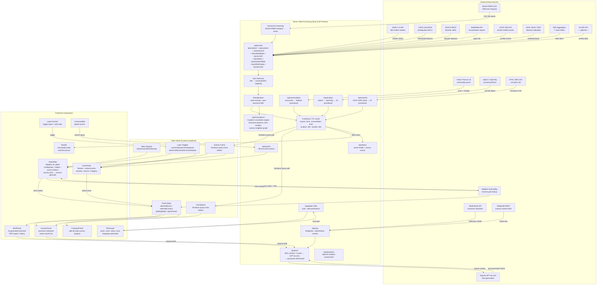

# ARGUS — Intelligence Data Flow

## Data source reliability tiers

| Tier | Sources | Fallback |
|------|---------|----------|
| **Live** | USGS earthquakes, Yahoo Finance | — always works |
| **Usually live** | GDELT (48h window + GKG fallback), ReliefWeb, UCDP | 25-event static fallback |
| **Intermittent** | WHO (JSON → RSS → hardcoded), GDACS, RSS feeds | Hardcoded fallback arrays |
| **Key-gated** | NASA FIRMS, ACLED | Skipped if env vars absent |
| **Procedural** | Aviation (25 aircraft), Vessels (22 ships) | Always shown, position-jittered |

## Correlation patterns detected

| # | Pattern | Signal |
|---|---------|--------|
| 1 | Geographic cluster | 3+ events within 500 km / 24 h |
| 2 | Multi-source convergence | Same location reported by 3+ sources |
| 3 | Escalation cascade | Severity rising across sequential events |
| 4 | Economic-conflict coupling | Commodity spike near conflict zone |
| 5 | Disaster-displacement | Disaster + humanitarian events co-located |
| 6 | Cyber-kinetic | Cyber event precedes physical attack |
| 7 | Chokepoint threat | Event within 200 km of strategic chokepoint |
| 8 | Cascading failure | Critical event cluster → broader region |
| 9 | Cross-border spillover | Events in neighboring countries within 48 h |
